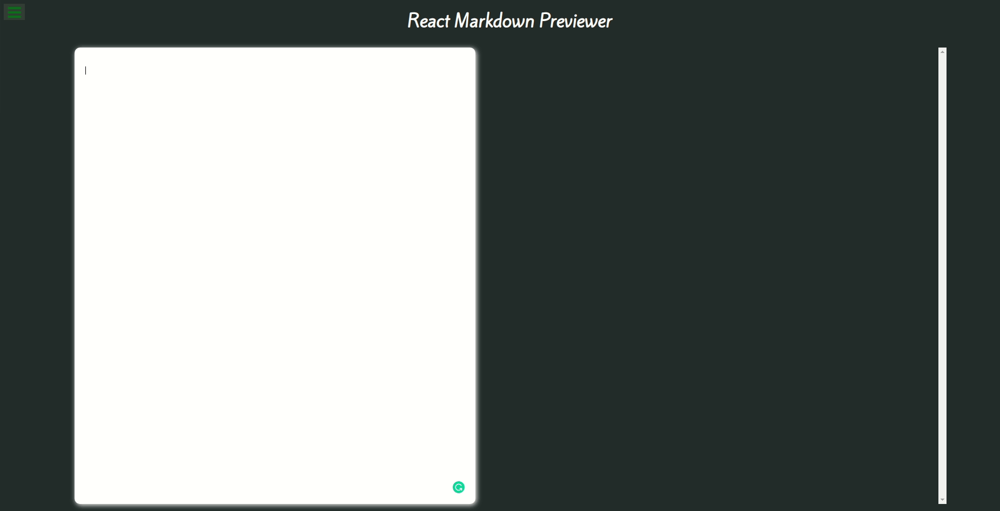

# Markdown Previewer

A simple Markdown editor and previewer than could help user edit and preview
her markdown document immediately.

    

## 1. Motivation

This project was built to reduce the inconvenience when editing and preview markdown documents (e.g. when you write a README file for your Github repository).

## 2. Languages, Libraries and Frameworks Used

This project was built with the following languages and libraries:

* VanillaJS: for some helper functions
* ReactJS: for building the main components of the application

## 3.Installation and Testing

Since this application is not hosted on any server, in order to test it, you will have to download the source code and compile the code on your local machine.

Follow these steps to run the application on your machine:
* Download the source code
* In the terminal window, move to the folder containing the source code for the project, then run the following command:
<code>~$ npm install</code>
The command will install all the necessary dependencies.
* Type the following command to run the application:
<code>~$ npm run start</code>

## 4. How to Use

Using the application is very simple, you just need to type your markdown document to the left box, the preview version of your document will be automatically displayed on the right box.

